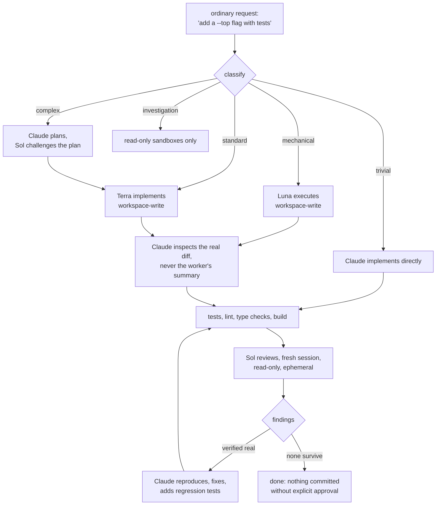
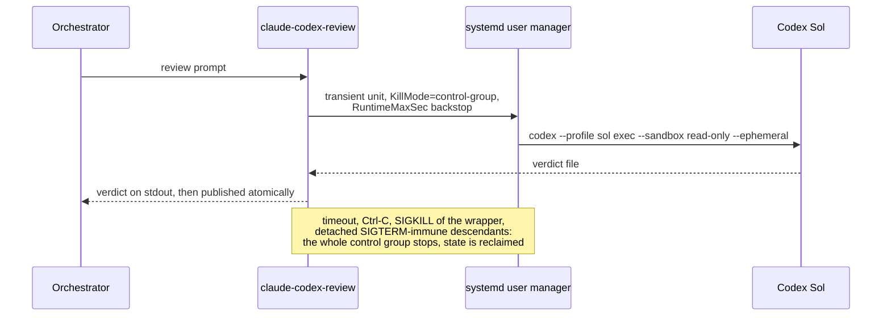

# Orrery

**One orchestrator, three workers, no residue.**

An orrery is a clockwork model of the solar system: one mechanism keeping
every body in its proper orbit. This kit does the same for AI-assisted
development. It makes **Claude Code the principal engineer** of every
session and the **Codex CLI its specialist crew**, named for their orbits:
**Luna** for mechanical work, **Terra** for implementation, **Sol** for
independent review. Around them sits an atomic configuration system, a
cross-model review harness with hard cleanup guarantees, and a session
hygiene layer that reverts everything a session creates.

You describe outcomes in ordinary language. The orchestration decides who
does what, inspects everything itself, and owns the result.

## How a request flows



Delegation never transfers responsibility. Codex failure never strands a
task: account-level errors fall back to Claude-only work under the same
acceptance criteria, transient errors get exactly one retry, and a missing
independent review is reported as a limitation rather than papered over.

## The cast

| Role | Backed by | Effort | Used for |
| --- | --- | --- | --- |
| Principal orchestrator | the active Claude Code model (default `opus`) | session setting | classification, planning, inspection, verification, ownership |
| Luna | `gpt-5.6-luna` | low | narrow, mechanical, well-specified edits |
| Terra | `gpt-5.6-terra` | medium | the default worker for substantial implementation |
| Sol | `gpt-5.6-sol` | high | independent review and difficult diagnosis |

No role is defined by a model name in workflow logic. Workers live in
`$CODEX_HOME/<profile>.config.toml`; the orchestrator's model lives in
settings. Swapping any of them is an edit, not a rewrite.

## Independent review, engineered



The wrapper refuses to run if the `sol` profile is missing, because Codex
silently substitutes its default model for an unknown profile, and a review
by an unannounced model is not an independent review. A completed verdict
is never lost: it reaches stdout before publication is attempted, and a
broken destination or closed stdout degrades gracefully.

## Leave No Trace

Five layers guarantee a session reverts every process, socket, temporary
file and browser profile it creates, engaging in this order:

| # | Layer | What it does |
| --- | --- | --- |
| 1 | Guard | A PreToolUse hook parses each command the way bash would (quotes, heredocs, substitutions) and denies unregistered detached processes before they start |
| 2 | Leases | `claude-lnt-start --ttl N -- cmd` grants a process the right to outlive its tool call; leases survive turn boundaries and follow daemonising work |
| 3 | Sweeps | After every tool call and at every stop, unleased session-owned processes are terminated and orphaned automation browser profiles reclaimed; pre-existing user data is never guessed about |
| 4 | Watchdog | A detached observer cleans up if Claude itself dies; if its 24-hour term expires with the session alive, it lapses rather than destroying live state |
| 5 | Session end | Final teardown overrides leases, runs registered rollbacks, and removes the session state directory |

## Changing models and providers

Model identity is data. The installed paths are symlinks, so every change
below is live immediately.

| To change | Edit | Then |
| --- | --- | --- |
| A new Claude model | its alias in `global/claude-models.json` | rerun `claude-codex-init <alias>` where pinned |
| The global default orchestrator | `model` in `global/claude-settings.json` | `./scripts/apply-claude-settings.py --model` |
| One repository's orchestrator | nothing: run `claude-codex-init <alias>` there | writes `.claude/settings.local.json`, kept out of Git |
| One session | nothing: `claude --model <name>` or `/model` | ephemeral |
| A Codex worker | `global/codex/<profile>.config.toml` | `claude-codex-doctor` |

**Running on a single provider.** If Codex is unavailable (quota, billing,
network), the orchestrator continues alone automatically, under the same
acceptance criteria, and says so. To make that deliberate rather than a
fallback, state it in the repository's `CLAUDE.local.md` (for example "Do
not use Codex in this repository"); the migration's conflict scan
recognises exactly this class of instruction. The reverse direction, doing
the orchestration on a Codex-first stack, is not supported: Claude Code is
the harness this kit drives.

**Adding a provider.** The pattern that admits a third provider (a Gemini
CLI, a local model server) is the same one Codex uses: a CLI the
orchestrator can call with a bounded prompt, a per-role profile file that
pins model and effort, a permission rule for the CLI, and a routing entry
in the orchestration skill. The files to touch are
`global/skills/development-orchestrator/SKILL.md` (routing),
`global/CLAUDE.md` (policy), a profile directory alongside `global/codex/`,
`global/claude-settings.json` (permissions), and `scripts/doctor.sh`
(validation). Roles, not providers, are the fixed points.

## Token usage

```bash
claude-codex-usage --since 7    # last week, per provider and model
claude-codex-usage --json       # machine-readable
```

Reads the providers' own local session logs (`~/.claude/projects`,
`$CODEX_HOME/sessions`), deduplicates replayed Claude messages, charges
each Codex session its final cumulative count only, and never touches the
network. It reports fresh input, cache reads, cache writes and output per
provider and model. It is an accounting of usage, not of billing.

## Installation

Requires [Claude Code](https://claude.com/claude-code), the
[Codex CLI](https://github.com/openai/codex), Python 3.11+, `git`, `jq`,
and paid access to both model providers.

### Linux (primary platform)

```bash
git clone <remote> ~/src/claude-codex-kit
cd ~/src/claude-codex-kit
./scripts/install.sh     # symlinks, hooks, one atomic settings merge
codex login              # once per machine
claude-codex-doctor      # 40+ checks, no model calls
```

`~/.local/bin` must be on `PATH`; the installer warns and the doctor fails
until it is. The installer is idempotent, backs up anything it moves aside
and says where, and preserves every setting it does not own.

### macOS

The same four commands. Differences, all detected automatically:

| Concern | On macOS |
| --- | --- |
| Review containment | plain process group instead of a transient systemd unit: timeout and interrupt still kill the group, but there is no `RuntimeMaxSec` backstop against an uncatchable wrapper death |
| Atomic settings swap | `renamex_np(RENAME_SWAP)` instead of `renameat2(RENAME_EXCHANGE)` |
| Process attribution | no procfs, so hygiene sweeps degrade conservatively: they never kill what they cannot attribute |
| Doctor | systemd checks are skipped with an explanation, not failed |

The macOS code paths follow Apple's platform documentation but have been
validated on Linux only; treat the first macOS install as a supervised one.

### Adopting an existing repository

```bash
claude-codex-init [model] /path/to/repository
```

Additive and idempotent: an existing `CLAUDE.md` is preserved untouched,
the private workflow block is managed between markers in `CLAUDE.local.md`
so reruns refresh rather than duplicate, both stay out of Git via
`.git/info/exclude`, and a conflict scan flags any existing instruction
that contradicts delegation before it can misfire.

## Proving it works

```bash
./tests/run-tests.py     # 92 deterministic tests, stand-in Codex, no credits
claude-codex-doctor      # CLAUDE_CODEX_KIT_READY when everything holds
```

The suite covers the settings updater's compare-and-swap under contention,
the review wrapper's cleanup on every signal and timing, lease semantics
across turn boundaries, the guard's shell parsing, the green-path install
and migration, and the usage tracker's arithmetic. It never touches live
configuration and spends no credits.

## Repository layout

| Path | Purpose |
| --- | --- |
| `global/CLAUDE.md` | The development policy, installed as `~/.claude/CLAUDE.md` |
| `global/claude-settings.json` | Canonical model, hooks, companion state, permissions |
| `global/claude-models.json` | Friendly model aliases for `claude-codex-init` |
| `global/codex/*.toml` | Worker profiles: model and reasoning effort per role |
| `global/skills/development-orchestrator/` | Task classification and routing |
| `global/hooks/leave-no-trace.py` | Session hygiene: guard, leases, sweeps, watchdog |
| `scripts/install.sh` | Installs every link and applies canonical settings |
| `scripts/init-project.sh` | `claude-codex-init`: migrates a repository |
| `scripts/claude-codex-review` | Synchronous independent Sol review |
| `scripts/claude-codex-usage` | Token usage across both providers |
| `scripts/apply-claude-settings.py` | Atomic, locked settings updater |
| `scripts/doctor.sh` | `claude-codex-doctor`: validates the installation |
| `tests/run-tests.py` | The deterministic regression suite |
| `docs/setup-guide.md` | Installation, routine use, maintenance |

Site-specific facts in `global/CLAUDE.md` (port exclusions, snap-browser
notes) are marked as such; edit them for your machine.

## Design principles

- **Claude decides and stays accountable.** Workers do bounded work Claude
  has scoped; Claude inspects the result rather than trusting the report.
- **Independence is a fact, not a claim.** Reviews are fresh sessions,
  read-only, by a different provider, through a wrapper that cannot
  misreport which model ran.
- **Fail closed, degrade honestly.** A missing profile refuses; an absent
  syscall refuses; an absent procfs stops attributing rather than
  guessing; every degradation is announced.
- **No version is ever destroyed.** Settings updates are compare-and-swap
  with preserved backups; a session leaves nothing behind it created and
  deletes nothing it cannot prove it created.
