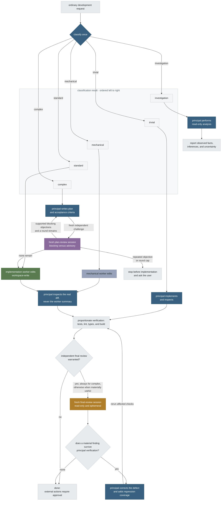

<p align="center">
  
</p>

# Órrery

**One orchestrator, four specialist roles, any model.**

Órrery, pronounced *OR-ər-ee*, is a provider-neutral development workflow for
Claude Code and the Codex CLI. One configured model is the principal
orchestrator. Separate processes can act as a mechanical worker,
implementation worker, plan reviewer, and final reviewer. Any role may use
Anthropic or OpenAI, including every role on one provider when the other
subscription is unavailable, or a third-party or local service such as Kimi,
DeepSeek, GLM, Qwen, MiniMax, OpenRouter, or Ollama through the same two
CLIs.

The principal classifies ordinary requests, delegates bounded work when useful,
inspects the real diff, verifies the outcome, and remains accountable. Role
names determine permissions and workflow; provider names do not.

Orchestration applies only in **adopted** repositories, marked by the
`.orrery.json` that `orrery-init` creates, or in sessions started through the
`orrery` launchers. Anywhere else, a direct Claude or Codex session behaves
as a normal single-provider session with the model chosen in its own
interface, governed by the engineering-baseline half of the shared policy
alone, and the SessionStart check says so explicitly.

## How a request flows



The five classifier outcomes are ordered exactly as shown: investigation,
trivial, mechanical, standard, complex.

| Class | Typical request | Route |
| --- | --- | --- |
| Investigation | “Why does this leak?” | read-only principal analysis; optional fresh second opinion |
| Trivial | “Fix this typo” | principal edits directly and runs the smallest relevant check |
| Mechanical | “Rename this exact symbol everywhere” | mechanical worker when delegation is worthwhile |
| Standard | “Add a `--top` flag with tests” | concise plan, bounded implementation, conditional final review |
| Complex | auth, migrations, concurrency | explicit plan, bounded plan-review cycle, implementation batches, mandatory fresh final review |

Plan review is a bounded challenge, not a search for agreement. Round one
classifies objections as blocking or advisory. The principal verifies them
against the repository. Later rounds ask only whether original blocking
objections survive. The default cap is two rounds, configurable from one to
four. A repeated blocker or an uncleared blocker at the cap stops before
implementation and asks the user to choose.

## Default roles

The shipped configuration:

| Role | Provider | Model | Thinking | Access | Timeout | Hard cap |
| --- | --- | --- | --- | --- | --- | --- |
| Principal orchestrator | Anthropic | `fable` | `max` | interactive principal | none | none |
| Mechanical worker | OpenAI | `gpt-5.6-luna` | `low` | workspace-write | 600 s | none |
| Implementation worker | OpenAI | `gpt-5.6-terra` | `medium` | workspace-write | 900 s | 1800 s |
| Plan reviewer | OpenAI | `gpt-5.6-sol` | `ultra` | read-only | 900 s | 1800 s |
| Final reviewer | OpenAI | `gpt-5.6-sol` | `ultra` | read-only | 900 s | 1800 s |

The timeout is the role's base budget for one delegated run; a `--timeout`
flag or an `ORRERY_AGENT_TIMEOUT_SECONDS` environment variable still wins.
The hard cap makes the budget progress-aware: at its base deadline a run
whose merged output grew within the last three minutes keeps running, in
two-minute steps, up to the cap (`hard_timeout_seconds` in the manifest,
`--hard-timeout` per run), because review time varies with task
complexity, rate limits, and time of day. A run that stalls, never
produces output, or reaches the cap times out exactly as before. The
runner surfaces the delegate's own newest output line every couple of
minutes so slow progress is visible rather than silent, with
provider-derived text sanitised so it can never forge Orrery's consent
markers or inject terminal escapes.
Read-only roles additionally run inside a service unit whose workspace is
mounted read-only by the kernel wherever the user manager supports mount
sandboxing; where an environment cannot enforce it, the runner announces
that protection is tool-level only rather than assuming the guarantee.

`global/orchestration.json` is the only role-assignment source. Every row may
be changed to either provider. For example, Sol may be the principal while
Fable or Opus reviews it, or all five roles may use Anthropic.

Each worker or reviewer is an independent CLI process and model context, not
necessarily a separate terminal window. Fresh context plus enforced
permissions provides session independence. A different provider or model adds
diversity, but same-provider and same-model operation remains valid and is
reported honestly.

## Runtime commands

Start the configured principal:

```bash
orrery
```

`orrery` supervises the provider process instead of replacing itself with it.
It checks command presence and login without running a model, observes the
principal's exit status, and can therefore propose a fallback after startup or
runtime failure.

Run a bounded supporting role:

```bash
orrery-agent --role mechanic -- "rename the specified symbol and run its tests"
orrery-agent --role implementer -- "implement the approved bounded change"
orrery-agent --role plan-reviewer -- "challenge this plan; remain read-only"
orrery-agent --role reviewer -- "review the final diff; remain read-only"
```

`orrery-review` remains a compatibility alias that defaults to the final
reviewer.

Fallback approval is exact, and any standing lifetime is explicit:

```bash
orrery --approve-fallback openai:gpt-5.6-sol
orrery-agent --role reviewer \
  --approve-fallback anthropic:fable -- "review the final diff"
orrery-agent --role reviewer --approve-fallback anthropic:fable \
  --approval-scope until:2026-08-05T16:49 -- "review the final diff"
orrery --revoke-fallbacks
orrery --no-fallback
```

Normally Orrery supplies the candidate and shows a numbered menu: this run
only, every project in this login session, every project until the
provider-stated reset time (offered only when the failure diagnostics state
one), or stop. The approval flag is for rerunning a non-interactive command
after the user accepts that exact provider/model; `--approval-scope`
defaults to `run`. A session or until choice records a standing approval
that later invocations start directly, disclosed on every use and
revocable at any time. The rerun starts the approved candidate directly
instead of retrying the failed configured process. It never changes the
saved role configuration.

The launcher builds provider commands from static adapters:

- Anthropic roles use `claude --model … --effort …`; delegated runs are
  non-persistent and use Claude’s reusable-prefix option.
- OpenAI roles use explicit `codex --model … -c
  model_reasoning_effort=…`; no profile can silently fall back.
- Reviewer access is fixed in code and cannot be widened by the prompt.
- The prompt is provided on stdin under a stable `ORRERY ROLE HANDOFF`, not
  exposed in the process argument list.
- The handoff carries a report-style line steering delegates away from
  wordy output: `verbosity` in the manifest (1 terse, 2 concise, 3
  unconstrained; default 1), overridable per run with `ORRERY_VERBOSITY`.

Delegated runs are synchronous. On systemd systems they live in a transient
user service with `KillMode=control-group` and a runtime backstop. Timeout,
interrupt, and cleanup act on the complete process tree. Other platforms use a
dedicated process group and announce the weaker containment.

## Visual configuration

```bash
orrery-config
```

The localhost-only page is generated from the canonical manifest. On launch it
discovers picker-visible models and each model's exact thinking levels from the
installed Claude and Codex CLIs, without running a model. Discovery is
concurrent and provider-independent: if one local interface is unavailable,
only that provider uses the bundled fallback catalogue. Equivalent Claude
aliases are collapsed, newly released models appear automatically, and every
role gets the same deduplicated menu grouped into Anthropic and OpenAI.
Selecting a known model rebuilds the adjacent thinking menu from that model's
reported capabilities. A custom exact identifier remains possible and
requires an explicit provider.

The diagram is the workflow, flowing left to right:

- the legend is the single place where roles are configured; the boxes show
  each live assignment as plain text;
- hovering a node outlines only that node, and steps sharing its role stay
  lit;
- the five classifier outcomes stack top to bottom in the required order;
- the plan and plan-review pair sit in a framed loop: a straight challenge
  arrow in, a return arc outside the frame, and the round cap between them;
- the standard branch and the loop's clean exit continue through one shared
  implementation node; and
- every path, including escalation, review bypass, correction, and
  completion, has an explicit destination.

Each role also has an **endpoint** menu. Leaving it on first-party runs the
role on the provider's own service; choosing a preset such as Kimi, DeepSeek,
GLM, Qwen, MiniMax, OpenRouter or a local Ollama points that role's CLI at
that service instead, and the role's model menu becomes the endpoint's own
models. Routing is per role, so a first-party principal can review the work of
a third-party implementer. Credentials stay in environment variables named by
the manifest, never in the manifest itself, and a missing one stops the run
rather than falling back to a first-party account. See
[docs/setup-guide.md](docs/setup-guide.md) for the wire-protocol limits.

Preview shows one atomic `global/orchestration.json` diff. Apply writes exactly
that preview and runs the doctor. Running sessions are never mutated. A
repository-local `.orrery.json` principal override, created by `orrery-init`,
wins over the global principal for that repository.

The same live catalogues support fallback ranking. Orrery first preserves the
provider for a model-only failure, then minimizes internal role/model distance,
prefers models already assigned to comparable roles, and maps the configured
thinking position onto the candidate's exact levels. Unknown future models use
their provider-picker position until explicitly seeded.

## Shared instructions and prompt caching

`global/AGENTS.md` is canonical and has two layers. Part I is an
engineering baseline that governs every Claude and Codex session on the
machine: assumptions surfaced before coding, the simplest complete change,
surgical diffs, goal-driven execution, verification before completion
claims, and leave-no-trace hygiene. Part II is the orchestration layer,
and it applies only in adopted repositories. The installer links the file
to both `$CODEX_HOME/AGENTS.md` and `~/.claude/AGENTS.md`.
`global/CLAUDE.md` contains only:

```text
@AGENTS.md
```

This follows Claude Code’s documented
[`AGENTS.md` import pattern](https://code.claude.com/docs/en/memory#agents-md)
while using Codex’s native
[`AGENTS.md` discovery](https://learn.chatgpt.com/docs/agent-configuration/agents-md).
The same provider-neutral orchestration skill is installed for both CLIs.
SessionStart hooks route every session to the right layer: in an un-adopted
repository they announce a standard single-provider session and stand the
orchestration layer down; in a delegated Orrery run they stay out of the
worker's way entirely; in an adopted repository they compare directly opened
Claude and Codex sessions with the configured principal. A mismatch is shown
to the user and injected into the agent context as
`ORRERY PRINCIPAL FALLBACK APPROVAL REQUIRED`; the direct session must ask
before acting as principal. The check refreshes on startup,
resume, clear, and compaction; approval already present in that conversation
remains valid unless revoked. SessionStart exposes the active model but not its
thinking level, so use `orrery` when effort must be mechanically enforced.
Codex requires new or changed non-managed hooks to be reviewed through
`/hooks`.

Both providers cache eligible prompt prefixes automatically. Orrery keeps the
shared policy stable, appends only the bounded task delta, selects model and
thinking before session start, keeps reviews fresh, and passes Claude’s
`--exclude-dynamic-system-prompt-sections`. It does not invent unsupported CLI
cache controls. See the official
[Claude caching guide](https://code.claude.com/docs/en/prompt-caching) and
[OpenAI prompt-caching guide](https://developers.openai.com/api/docs/guides/prompt-caching).

## Provider failure

Orrery automatically finds a fallback candidate but never automatically grants
permission to use it:

- a missing CLI or inactive login is detected before inference;
- account, quota, billing, authentication, or unknown provider failure excludes
  that provider from the next candidate;
- model-specific failure, including a timeout or a limit announced for one
  model, prefers the nearest model on the same provider (an unavailable
  `fable` proposes `opus`), crossing providers only when the same-provider
  capability gap reaches two tiers;
- a recognized transient failure is retried once before fallback is proposed,
  except when a failed writer changed the workspace; budget timeouts are
  never retried in place, but a run whose output is still growing first
  extends to its hard cap before a timeout is declared;
- a terminal shows a numbered menu (this run, this login session, until the
  provider-stated reset time when the diagnostics state one, or stop);
  Enter and any unrecognised input stop;
- an IDE or other non-interactive caller receives
  `ORRERY FALLBACK APPROVAL REQUIRED` with the candidate, the offerable
  scopes, and the exact rerun flags, and must ask the user;
- candidate approval is bound to the exact `PROVIDER:MODEL`; a lifetime
  beyond the run additionally requires `--approval-scope session` or
  `--approval-scope until:<ISO8601>`;
- a session or until choice records a standing approval: prior consent
  stored outside the repository, disclosed on every use, listed by the
  doctor and the configuration page, self-expiring, revocable with
  `orrery --revoke-fallbacks`, skipped when the role is reconfigured, and
  always overridden by `--no-fallback`, an explicit `--approve-fallback`,
  and the changed-workspace writer refusal;
- an approved rerun starts the exact identity the user named, accepted from
  anywhere in the current ranking with every nearer candidate excluded, so
  a non-interactive fallback ladder stays approvable rung by rung;
- if a failed writer changed the Git workspace, Orrery refuses an inline
  handoff and requires inspection plus a separately approved rerun; and
- unavailable independent review is reported rather than falsely claimed.

Candidate availability is intentionally described as potential. Login and
picker discovery spend no model tokens and cannot prove remaining credits; an
approved candidate may still fail, in which case Orrery reports it and ranks
the next remaining candidate. If no authenticated candidate remains, Orrery
says so. Cross-provider fallback starts a fresh context and omits
provider-specific principal arguments; it never claims conversation migration.

## Installation

Requirements:

- Python 3.11+, `git`, and `jq`;
- Claude Code for roles assigned to Anthropic;
- Codex CLI for roles assigned to OpenAI;
- systemd is recommended on Linux for control-group containment.

```bash
git clone <remote> ~/src/orrery
cd ~/src/orrery
./scripts/install.sh
orrery-doctor
```

The installer is idempotent. It backs up displaced user files under
`~/.orrery-backups`, installs the shared instructions and skill for both CLIs,
installs launch commands in `~/.local/bin`, and removes only obsolete
checkout-owned profile links. A pre-existing `$CODEX_HOME/AGENTS.override.md`
is preserved and warned about because it shadows the installed policy.

### Adopt a repository

```bash
orrery-init [model] /path/to/repository
```

If the directory is not already a Git worktree, Orrery initializes Git first.
For a new repository it creates canonical `AGENTS.md` plus the one-line Claude
import. Existing arbitrary instruction files are preserved. A Claude-only
project is mirrored into `AGENTS.md` for Codex with a reconciliation warning;
existing files for both tools are never overwritten.

An optional known model writes a private `.orrery.json` principal override and
adds it to `.git/info/exclude`. The migration removes only retired
Orrery-owned blocks from `CLAUDE.local.md`, preserves surrounding personal
instructions, and scans all relevant instruction files for delegation or
privacy conflicts.

## Leave No Trace

The Claude-hosted lifecycle layer guards detached commands, leases processes
that must span calls, sweeps session-owned residue, registers rollbacks, and
performs final teardown. The provider-neutral agent runner separately contains
every delegated process tree and cleans its private prompt, settings, log, and
result state.

Pre-existing user processes and data are never guessed about or removed.
Codex-principal sessions still follow the same cleanup policy through
`AGENTS.md`; the current automatic lifecycle hook installation is
Claude-specific.

## Token usage

```bash
orrery-usage --since 7
orrery-usage --json
```

This reads local Claude and Codex session logs, deduplicates replayed messages,
and reports fresh input, cache reads, cache writes, and output by provider and
model. It does not access the network.

## Incident log

```bash
orrery-incidents --since 7
orrery-incidents --json
```

Every launcher failure is also a data point: blockers, timeouts, fallback
proposals and their outcomes, consent stops, degraded containment, and
cleanup problems are appended as JSON lines to
`~/.local/state/orrery/incidents.jsonl`, outside every repository. Events
hold structured identities and wrapper-authored reasons only, never
prompts, verdicts, diagnostics text, or credentials; writing is
best-effort and cannot change a run's outcome. `orrery-incidents`
aggregates the log and the doctor warns when the last 7 days recorded
anything, so the default configuration can be tuned with evidence rather
than memory.

## Verification

```bash
./tests/run-tests.py
orrery-doctor
```

The deterministic suite uses fake provider commands and spends no model
credits. The doctor validates files, role assignments, links, provider
availability for configured roles, endpoint routing and credentials, access
contracts, and instruction imports, and warns when the installed Claude CLI
drifts from the version the delegated-run behaviour was validated against.
The same lint and suite run on GitHub Actions for every push and pull
request.

## Repository layout

| Path | Purpose |
| --- | --- |
| `global/AGENTS.md` | canonical provider-neutral development policy |
| `global/CLAUDE.md` | one-line Claude import of `AGENTS.md` |
| `global/orchestration.json` | role assignments, workflow settings, and configuration-chart geometry |
| `global/model-catalogue.json` | provider fallback choices and Orrery-specific thinking defaults |
| `global/endpoints.json` | offered third-party and local endpoint presets |
| `global/claude-settings.json` | Claude-specific hooks and permissions, not role selection |
| `global/codex-hooks.json` | Codex SessionStart principal-mismatch notification |
| `global/skills/development-orchestrator/` | detailed classification and routing procedure |
| `global/hooks/leave-no-trace.py` | Claude lifecycle cleanup implementation |
| `project-template/AGENTS.md` | canonical per-repository project template |
| `project-template/CLAUDE.md` | one-line project import |
| `scripts/orrery` | supervised configured-principal launcher |
| `scripts/orrery_fallback.py` | provider checks, nearest-model ranking, failure classification, and consent |
| `scripts/orrery_standing.py` | scoped standing-approval store with locked serialisation |
| `scripts/orrery-session-start` | direct Claude/Codex principal-mismatch hook |
| `scripts/orrery_model_catalogue.py` | no-inference live model and thinking-capability discovery |
| `scripts/orrery_runtime.py` | validated role loader and static provider adapters |
| `scripts/orrery-review` | contained generic role runner; compatibility filename |
| `scripts/orrery_incidents.py` | best-effort incident log writer and validated reader |
| `scripts/orrery-incidents` | incident aggregation and reporting command |
| `scripts/orrery-config` | atomic visual configuration surface |
| `scripts/init-project.sh` | safe project adoption and Git initialization |
| `scripts/install.sh` | user-level instruction, skill, hook, and command links |
| `scripts/doctor.sh` | installation and configuration diagnostics |
| `tests/run-tests.py` | deterministic regression suite |
| `.github/workflows/ci.yml` | lint and suite on every push and pull request |
| `docs/setup-guide.md` | detailed operation and maintenance |

## Design principles

- **Orchestration is opt-in.** Only adopted repositories run the workflow;
  everywhere else a session stays a standard single-provider session.
- **Responsibility stays with the principal.** Workers perform bounded work;
  the principal inspects and verifies it.
- **Roles are not providers.** Any supported model may be principal, worker,
  or reviewer.
- **Independence is stated precisely.** Fresh sessions are independent;
  provider diversity is an additional property.
- **One source of truth.** Role provider, model, thinking, and access live in
  one manifest.
- **Fail closed, degrade honestly.** Permissions cannot be widened by a
  prompt, and missing independent review is never disguised.
- **No residue.** Every owned process and temporary artifact is bounded and
  reclaimed.

## Licence

MIT. Provider products and model names remain the property of their respective
owners.
