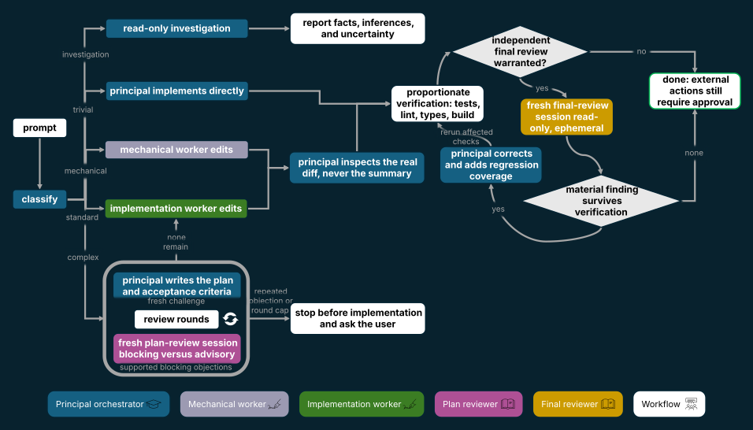
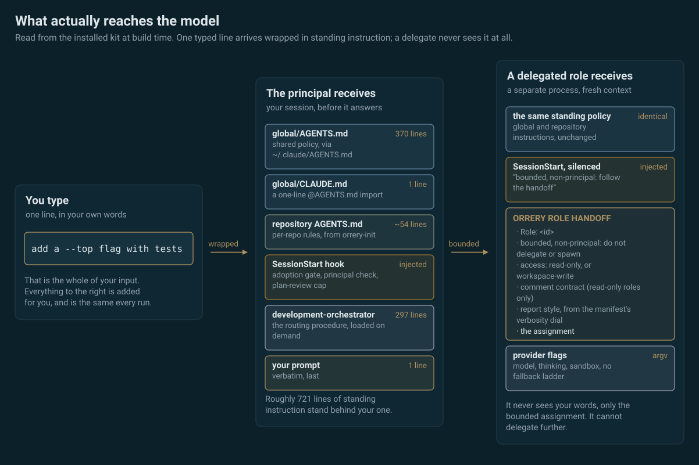

<p align="center">
  
</p>

# Órrery

[](https://github.com/nikfilippas/orrery/actions/workflows/ci.yml)

**One orchestrator, four specialist roles, any model.**

Órrery, pronounced *OR-ər-ee*, is a provider-neutral **agent
orchestration layer** for Claude Code and the Codex CLI. In the
vocabulary of the evaluation literature it is an **agent meta-harness**:
a scaffold over the two coding-agent harnesses that decides which role
runs, on which provider and model, with which permissions, and how the
result is verified. One configured model is the principal orchestrator;
separate processes act as mechanical worker, implementation worker, plan
reviewer and final reviewer, on Anthropic, OpenAI, or a third-party or
local endpoint, through the same two CLIs.

The principal classifies each request, delegates bounded work when
useful, inspects the real diff, verifies the outcome, and remains
accountable. Role names determine permissions and workflow; provider
names do not. Orchestration is opt-in per repository: `orrery-init`
adopts a repository, and everywhere else a session stays a normal
single-provider session and says so.

## Why this layer exists

- **Bounded, independent review.** Plans and final diffs go to fresh
  read-only reviewer sessions; objections are classified blocking or
  advisory, the loop is capped, and deadlocks escalate to you instead of
  iterating to agreement.
- **Findings that outlive the reviewer.** A task review returns a
  schema-validated document, not a paragraph. Findings need evidence, an
  implementer may answer one but never close it, and a task cannot merge
  while a blocking finding is unresolved, including after rework and a
  later clean review.
- **Parallel work, integrated on evidence.** Independent tasks run in
  isolated worktrees and merge only through a gate that re-runs the union
  of their acceptance checks, so one task cannot land a change that breaks
  another's invariant. What awaits a human decision is drawn into one
  queue, ranked most serious first, every row stating its reason and
  verifying the evidence it cites.
- **Enforced containment, not promised containment.** Read-only roles
  run inside a service unit whose workspace mapping is enforced by the
  kernel and probed before every run; where the guarantee cannot be
  established the run is refused, with one named escape hatch.
- **Authority that never escalates.** A delegate holds exactly the
  toolset and access mode its role grants, denied by default and
  enforced outside the model, and a delegate cannot delegate: the
  role handoff stands its session down from orchestration, so no
  chain of agents can accumulate authority the principal never
  granted.
- **Consent-gated fallback.** A failed provider yields a ranked
  candidate and a numbered consent menu; nothing crosses a provider,
  endpoint or billing boundary without your explicit approval, and
  standing approvals are disclosed on every use and revocable. An
  exhausted plan is never answered by substitution: `orrery-pickup`
  parks the stopped work instead and re-dispatches it when the
  provider's stated limit resets, offline, under a spend ceiling, with
  the merge gate still yours.
- **Nothing hidden, nothing left behind.** Every standing instruction a
  session carries is a file in this repository; delegated process trees
  are contained and cleaned; failures land in a local incident log so
  the configuration can be tuned from evidence.

## How a request flows

<p align="center">
  
</p>

| Class | Typical request | Route |
| --- | --- | --- |
| Investigation | “Why does this leak?” | read-only principal analysis; optional fresh second opinion |
| Trivial | “Fix this typo” | principal edits directly and runs the smallest relevant check |
| Mechanical | “Rename this exact symbol everywhere” | mechanical worker when delegation is worthwhile |
| Standard | “Add a `--top` flag with tests” | concise plan, bounded implementation, conditional final review |
| Complex | auth, migrations, concurrency | explicit plan, bounded plan-review cycle, implementation batches, mandatory fresh final review |

### What is actually sent

You type one line. The session answering it has already been given
several hundred lines of standing instruction, and a delegated role is
given that same instruction with a bounded assignment in place of your
words. None of it is hidden: every file below is in this repository.

<p align="center">
  
</p>

## Quick start

Requirements: Python 3.11+, `git`, `jq`; Claude Code for Anthropic
roles, Codex CLI for OpenAI roles; systemd recommended on Linux for
control-group containment.

```bash
git clone <remote> ~/src/orrery
cd ~/src/orrery
./scripts/install.sh
orrery-doctor
orrery-init /path/to/repository   # adopt a repository
orrery                            # start the configured principal
```

Roles, models, thinking levels, endpoints and the plan-review cap are
configured visually with `orrery-config`; a frozen copy of the page is
**[browsable on GitHub Pages](https://nikfilippas.github.io/orrery/config-demo.html)**
without installing anything. The shipped defaults put the principal on
Anthropic and the workers and reviewers on OpenAI; every row of
`global/orchestration.json` may be changed to either provider, a
third-party endpoint, or one provider for everything.

## Evidence, not adjectives

Órrery advertises no speed multipliers and no token-saving
percentages. What it claims is what its test suite enforces: a
deterministic 350-plus-test regression suite that spends no model
credits, lint and suite on CI for every push, a doctor that validates
the installation, kernel-level probes before every read-only delegated
run, non-escalating delegation (a role's toolset is closed and denied
by default, and a delegate that is asked to orchestrate stands down),
honest degradation messages where a guarantee cannot hold, local
token-usage and incident accounting (`orrery-usage`, `orrery-incidents`),
and a memory whose every fact carries the command that re-checks it
(`orrery-memory`). Performance and cost effects are the subject of a
dedicated with/without benchmark programme, published with unfavourable
numbers included; see the technical overview.

## Learn more

- **[Technical overview](docs/technical-overview.md)**: every surface
  in detail: positioning and terminology, roles and budgets,
  containment, runtime commands, the task control plane, fallback and
  consent, caching, verification, and the benchmark programme.
- **[Setup guide](docs/setup-guide.md)**: operation and maintenance.
- **[Configuration page demo](https://nikfilippas.github.io/orrery/config-demo.html)**.

## Design principles

- **Orchestration is opt-in.** Only adopted repositories run the
  workflow; everywhere else a session stays a standard single-provider
  session.
- **Responsibility stays with the principal.** Workers perform bounded
  work; the principal inspects and verifies it.
- **Roles are not providers.** Any supported model may be principal,
  worker, or reviewer.
- **Independence is stated precisely.** Fresh sessions are independent;
  provider diversity is an additional property.
- **One source of truth.** Role provider, model, thinking, and access
  live in one manifest.
- **Fail closed, degrade honestly.** Permissions cannot be widened by a
  prompt, and missing independent review is never disguised.
- **No residue.** Every owned process and temporary artifact is bounded
  and reclaimed.

## Licence

MIT. Provider products and model names remain the property of their
respective owners.
