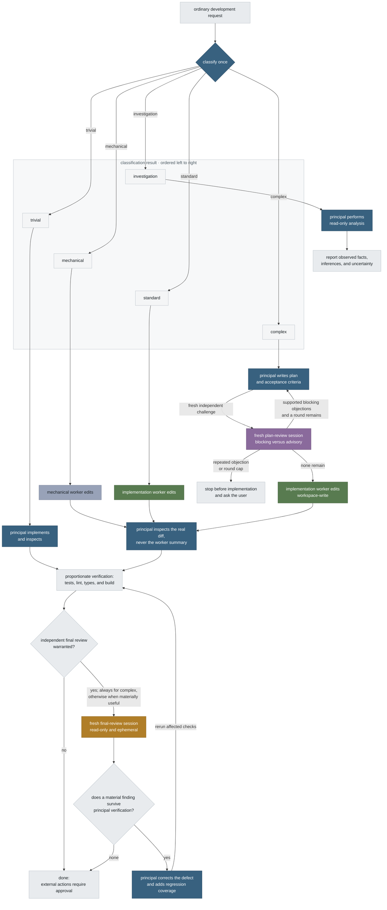

<p align="center">
  
</p>

# Órrery

**One orchestrator, four specialist roles, either provider.**

Órrery, pronounced *OR-ər-ee*, is a provider-neutral development workflow for
Claude Code and the Codex CLI. One configured model is the principal
orchestrator. Separate processes can act as a mechanical worker,
implementation worker, plan reviewer, and final reviewer. Any role may use
Anthropic or OpenAI, including every role on one provider when the other
subscription is unavailable.

The principal classifies ordinary requests, delegates bounded work when useful,
inspects the real diff, verifies the outcome, and remains accountable. Role
names determine permissions and workflow; provider names do not.

## How a request flows



The five classifier outcomes are ordered exactly as shown: investigation,
trivial, mechanical, standard, complex.

| Class | Typical request | Route |
| --- | --- | --- |
| Investigation | “Why does this leak?” | read-only principal analysis; optional fresh second opinion |
| Trivial | “Fix this typo” | principal edits directly and runs the smallest relevant check |
| Mechanical | “Rename this exact symbol everywhere” | mechanical worker when delegation is worthwhile |
| Standard | “Add a `--top` flag with tests” | concise plan, bounded implementation, conditional final review |
| Complex | auth, migrations, concurrency | explicit plan, bounded plan-review cycle, implementation batches, mandatory fresh final review |

Plan review is a bounded challenge, not a search for agreement. Round one
classifies objections as blocking or advisory. The principal verifies them
against the repository. Later rounds ask only whether original blocking
objections survive. The default cap is two rounds, configurable from one to
four. A repeated blocker or an uncleared blocker at the cap stops before
implementation and asks the user to choose.

## Default roles

These defaults are unchanged:

| Role | Provider | Model | Thinking | Access |
| --- | --- | --- | --- | --- |
| Principal orchestrator | Anthropic | `fable` | `max` | interactive principal |
| Mechanical worker | OpenAI | `gpt-5.6-luna` | `low` | workspace-write |
| Implementation worker | OpenAI | `gpt-5.6-terra` | `medium` | workspace-write |
| Plan reviewer | OpenAI | `gpt-5.6-sol` | `ultra` | read-only |
| Final reviewer | OpenAI | `gpt-5.6-sol` | `ultra` | read-only |

`global/orchestration.json` is the only role-assignment source. Every row may
be changed to either provider. For example, Sol may be the principal while
Fable or Opus reviews it, or all five roles may use Anthropic.

Each worker or reviewer is an independent CLI process and model context, not
necessarily a separate terminal window. Fresh context plus enforced
permissions provides session independence. A different provider or model adds
diversity, but same-provider and same-model operation remains valid and is
reported honestly.

## Runtime commands

Start the configured principal:

```bash
orrery
```

Run a bounded supporting role:

```bash
orrery-agent --role mechanic -- "rename the specified symbol and run its tests"
orrery-agent --role implementer -- "implement the approved bounded change"
orrery-agent --role plan-reviewer -- "challenge this plan; remain read-only"
orrery-agent --role reviewer -- "review the final diff; remain read-only"
```

`orrery-review` remains a compatibility alias that defaults to the final
reviewer.

The launcher builds provider commands from static adapters:

- Anthropic roles use `claude --model … --effort …`; delegated runs are
  non-persistent and use Claude’s reusable-prefix option.
- OpenAI roles use explicit `codex --model … -c
  model_reasoning_effort=…`; no profile can silently fall back.
- Reviewer access is fixed in code and cannot be widened by the prompt.
- The prompt is provided on stdin under a stable `ORRERY ROLE HANDOFF`, not
  exposed in the process argument list.

Delegated runs are synchronous. On systemd systems they live in a transient
user service with `KillMode=control-group` and a runtime backstop. Timeout,
interrupt, and cleanup act on the complete process tree. Other platforms use a
dedicated process group and announce the weaker containment.

## Visual configuration

```bash
orrery-config
```

The localhost-only page is generated from the canonical manifest. On launch it
discovers picker-visible models and each model's exact thinking levels from the
installed Claude and Codex CLIs, without running a model. Discovery is
concurrent and provider-independent: if one local interface is unavailable,
only that provider uses the bundled fallback catalogue. Equivalent Claude
aliases are collapsed, newly released models appear automatically, and every
role gets the same deduplicated menu grouped into Anthropic and OpenAI.
Selecting a known model rebuilds the adjacent thinking menu from that model's
reported capabilities. A custom exact identifier remains possible and
requires an explicit provider.

The diagram is the workflow:

- hovering a node outlines only that node;
- tandem nodes using the same role are highlighted without another outline;
- the five classifier arrows run primarily downward in the required order;
- the plan and plan-review arrows use equal and opposite curves to form one
  visual cycle; and
- investigation, escalation, review bypass, correction, and completion all
  have explicit destinations.

Preview shows one atomic `global/orchestration.json` diff. Apply writes exactly
that preview and runs the doctor. Running sessions are never mutated. A
repository-local `.orrery.json` principal override, created by `orrery-init`,
wins over the global principal for that repository.

## Shared instructions and prompt caching

`global/AGENTS.md` is canonical. The installer links it to both
`$CODEX_HOME/AGENTS.md` and `~/.claude/AGENTS.md`.
`global/CLAUDE.md` contains only:

```text
@AGENTS.md
```

This follows Claude Code’s documented
[`AGENTS.md` import pattern](https://code.claude.com/docs/en/memory#agents-md)
while using Codex’s native
[`AGENTS.md` discovery](https://learn.chatgpt.com/docs/agent-configuration/agents-md).
The same provider-neutral orchestration skill is installed for both CLIs.

Both providers cache eligible prompt prefixes automatically. Orrery keeps the
shared policy stable, appends only the bounded task delta, selects model and
thinking before session start, keeps reviews fresh, and passes Claude’s
`--exclude-dynamic-system-prompt-sections`. It does not invent unsupported CLI
cache controls. See the official
[Claude caching guide](https://code.claude.com/docs/en/prompt-caching) and
[OpenAI prompt-caching guide](https://developers.openai.com/api/docs/guides/prompt-caching).

## Provider failure

An exhausted provider does not strand ordinary work:

- account, quota, billing, or authentication failure is not retried on that
  provider;
- a model-specific failure may use one deliberate suitable alternative;
- a transient failure gets one retry;
- partial write-capable work is inspected before another writer runs; and
- unavailable independent review is reported rather than falsely claimed.

Users can avoid fallback entirely by assigning all roles to the provider they
still have available. Orrery never claims that an already-running interactive
conversation can transparently migrate between providers.

## Installation

Requirements:

- Python 3.11+, `git`, and `jq`;
- Claude Code for roles assigned to Anthropic;
- Codex CLI for roles assigned to OpenAI;
- systemd is recommended on Linux for control-group containment.

```bash
git clone <remote> ~/src/orrery
cd ~/src/orrery
./scripts/install.sh
orrery-doctor
```

The installer is idempotent. It backs up displaced user files under
`~/.orrery-backups`, installs the shared instructions and skill for both CLIs,
installs launch commands in `~/.local/bin`, and removes only obsolete
checkout-owned profile links. A pre-existing `$CODEX_HOME/AGENTS.override.md`
is preserved and warned about because it shadows the installed policy.

### Adopt a repository

```bash
orrery-init [model] /path/to/repository
```

If the directory is not already a Git worktree, Orrery initializes Git first.
For a new repository it creates canonical `AGENTS.md` plus the one-line Claude
import. Existing arbitrary instruction files are preserved. A Claude-only
project is mirrored into `AGENTS.md` for Codex with a reconciliation warning;
existing files for both tools are never overwritten.

An optional known model writes a private `.orrery.json` principal override and
adds it to `.git/info/exclude`. The migration removes only retired
Orrery-owned blocks from `CLAUDE.local.md`, preserves surrounding personal
instructions, and scans all relevant instruction files for delegation or
privacy conflicts.

## Leave No Trace

The Claude-hosted lifecycle layer guards detached commands, leases processes
that must span calls, sweeps session-owned residue, registers rollbacks, and
performs final teardown. The provider-neutral agent runner separately contains
every delegated process tree and cleans its private prompt, settings, log, and
result state.

Pre-existing user processes and data are never guessed about or removed.
Codex-principal sessions still follow the same cleanup policy through
`AGENTS.md`; the current automatic lifecycle hook installation is
Claude-specific.

## Token usage

```bash
orrery-usage --since 7
orrery-usage --json
```

This reads local Claude and Codex session logs, deduplicates replayed messages,
and reports fresh input, cache reads, cache writes, and output by provider and
model. It does not access the network.

## Verification

```bash
./tests/run-tests.py
orrery-doctor
```

The deterministic suite uses fake provider commands and spends no model
credits. The doctor validates files, role assignments, links, provider
availability for configured roles, access contracts, and instruction imports.

## Repository layout

| Path | Purpose |
| --- | --- |
| `global/AGENTS.md` | canonical provider-neutral development policy |
| `global/CLAUDE.md` | one-line Claude import of `AGENTS.md` |
| `global/orchestration.json` | role assignments, workflow settings, and configuration-chart geometry |
| `global/model-catalogue.json` | provider fallback choices and Orrery-specific thinking defaults |
| `global/claude-settings.json` | Claude-specific hooks and permissions, not role selection |
| `global/skills/development-orchestrator/` | detailed classification and routing procedure |
| `global/hooks/leave-no-trace.py` | Claude lifecycle cleanup implementation |
| `project-template/AGENTS.md` | canonical per-repository project template |
| `project-template/CLAUDE.md` | one-line project import |
| `scripts/orrery` | configured principal launcher |
| `scripts/orrery_model_catalogue.py` | no-inference live model and thinking-capability discovery |
| `scripts/orrery_runtime.py` | validated role loader and static provider adapters |
| `scripts/orrery-review` | contained generic role runner; compatibility filename |
| `scripts/orrery-config` | atomic visual configuration surface |
| `scripts/init-project.sh` | safe project adoption and Git initialization |
| `scripts/install.sh` | user-level instruction, skill, hook, and command links |
| `scripts/doctor.sh` | installation and configuration diagnostics |
| `tests/run-tests.py` | deterministic regression suite |
| `docs/setup-guide.md` | detailed operation and maintenance |

## Design principles

- **Responsibility stays with the principal.** Workers perform bounded work;
  the principal inspects and verifies it.
- **Roles are not providers.** Any supported model may be principal, worker,
  or reviewer.
- **Independence is stated precisely.** Fresh sessions are independent;
  provider diversity is an additional property.
- **One source of truth.** Role provider, model, thinking, and access live in
  one manifest.
- **Fail closed, degrade honestly.** Permissions cannot be widened by a
  prompt, and missing independent review is never disguised.
- **No residue.** Every owned process and temporary artifact is bounded and
  reclaimed.

## Licence

MIT. Provider products and model names remain the property of their respective
owners.
